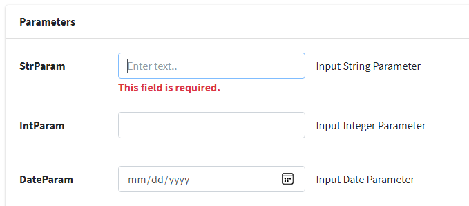
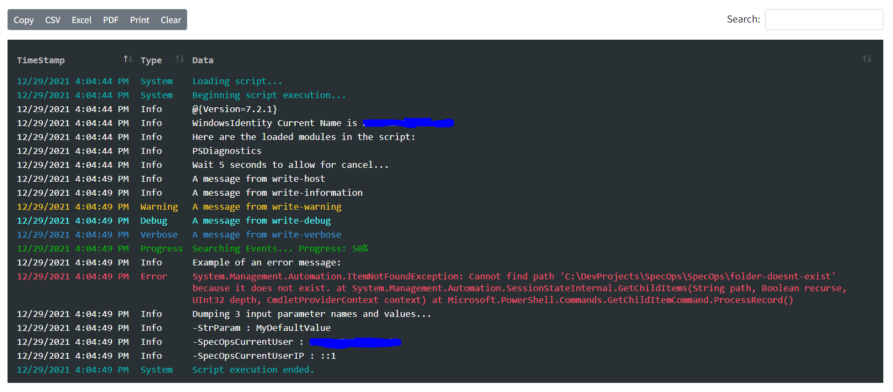

# SpecOps
### Tactical Scripting


<br/><br/>

SpecOps is a .NET5 web application that allows you to centralize and host your PowerShell scripts for execution by anyone, particularly non-technical staff.  The application is written with PowerShell in mind, but could easily be extended to allow other types.  The application is intended to be used in a Windows-based Intranet environment.

Scripts are added and configured dynamically through the **scriptsettings.json** configuration file.  Scripts can be added and changed on the fly, and the configuration specified in the json file allows for the dynamic generation of a GUI for users to input parameter values via rudimentary support for [HTML5 input element types](https://developer.mozilla.org/en-US/docs/Web/HTML/Element/input) (i.e. text, date, number, etc.).  The application leverages the [jQuery Validation library](https://jqueryvalidation.org/) so that basic validation is also possible by specifying HTML5-based attributes such as [required](https://developer.mozilla.org/en-US/docs/Web/HTML/Attributes/required), [pattern](https://developer.mozilla.org/en-US/docs/Web/HTML/Attributes/pattern), etc.

The application leverages [Bootstrap4](https://getbootstrap.com/docs/4.0/getting-started/introduction/) and the [AdminLTE](https://adminlte.io/) theme for styling with all plugins available.  

Script output is returned in realtime via [SignalR](https://dotnet.microsoft.com/apps/aspnet/signalr).  [Serilog](https://serilog.net/) is set up for logging to a file, but can easily be extended to log to a database, elasticsearch, etc.

#### Security

Security is based around the concept of **Security Policies** for different types of users (i.e. Admin, HelpDesk, L2-Support, etc.).  Scripts themselves are grouped into **Categories**.  Security Policies are defined in the **appsettings.json** file, and specify the Categories of scripts allowed for users in that policy as well as the Active Directory groups that are members of that policy.  To access the site, you must be a member of an AD group included in one of the policies.  The Script Runner page automatically determines the appropriate script Categories available and only shows the relevant scripts.

```json
    "SecurityPolicies": [
      {
        "Name": "Admin",
        "Groups": [ "mydomain\\abc", "mydomain\\def" ],
        "CategoryIds": [ "Admin" ]
      },
      {
        "Name": "HelpDesk",
        "Groups": [ "mydomain\\uvw", "mydomain\\xyz" ],
        "CategoryIds": [ "MyApp1", "MyApp2" ]
      }
    ]
```

#### Script Configuration

Scripts are configured in **scriptsettings.json**.

1) **CategoryId** allows for grouping of related scripts and can be any meaningful value (Admin, HelpDesk, MyApplication, etc.)
2) **Id** is the script's unique identifier and should be unique across all scripts (regardless of Category).  A GUID is recommended.
3) **PathAndFilename** may be relevant to the application's folder (i.e. ./Scripts/Demo.ps1) or could be any fully qualified path to which the AppPoolIdentity has access.
4) **Name** is the user-friendly (short) name of the script that will be shown in the dropdown.
5) **Summary** is a brief description of the script and will be shown when selected in the dropdown.
6) **InputParms** is an array of Input Parameter objects for each parameter to be passed into the script.
    * **Name** should match the parameter name expected in the script
    * **Description** is a brief user-friendly description of the parameter
    * **Placeholder** optional text to be shown inside the input element (if relevant)
    * **Type** specifies the desired input element type to use for the parameter and is based on the [HTML5 input element types](https://developer.mozilla.org/en-US/docs/Web/HTML/Element/input) 
    * **Min**, **Max**, **Step** are integer values used in combination with Type=**range** to facilitate a slider
    * **List** is an array of values used in combination with Type=**text** to facilitate a dropdown
    * **Required** with a value of **true** may be used to cause the parameter to be required
    * **Pattern** may be used to apply a desired regex pattern for validation
7) Custom Runspace pools are also supported 
    * **ExecutionPolicy** allows for specifying the desired [Microsoft.PowerShell.ExecutionPolicy](https://docs.microsoft.com/en-us/dotnet/api/microsoft.powershell.executionpolicy?view=powershellsdk-7.0.0) string name such as Unrestricted, Bypass, etc.
    * **Min** is an integer value and specifies the minimum number of runspaces to allocate to the pool
    * **Max** is an integer value and specifies the maximum number of runspaces to allocate to the pool.  Recommended at n+1 where n=number of processors.
    * **Modules** allows for an array of strings for specifying PowerShell modules to load into the pool

```json
"ScriptSettings": [
    {
      "CategoryId": "Admin",
      "Id": "7CF9D423-5CB7-432B-A3E9-618340ADF5A7",
      "PathAndFilename": "./Scripts/Demo.ps1",
      "Name": "Demo",
      "Summary": "This is a brief summary of what the demo script does....",
      "InputParms": [
        {
          "Name": "StrParam1",
          "Type": "text",
          "Description": "Input 3-letter String Parameter",
          "Placeholder": "Enter text here...",
          "Required": "true",
          "Pattern": "[A-Za-z]{3}"
        },
        {
          "Name": "ListParam1",
          "Type": "text",
          "Description": "Input Range List Parameter",
          "List": [ "value1", "value2", "value3" ]
        }
      ],
      "Runspace": {
        "ExecutionPolicy":  "Unrestricted",
        "Min": 1,
        "Max": 2,
        "Modules": [
          "PSDiagnostics"
        ]
      }
    }
  }
]
```

<br/>



<br/><br/>

#### Script Writing

Writing to the different output streams in the PowerShell script will trigger different output levels in the log.  The desired css class can be specified for each level via the **appsettings.json** file as to facilitate the desired color coding of the log text.  Each log record is also timestamped.

| PowerShell Write               | Output Level |
| :---                           | :---         |
| `Write-Output`                | Data         |
| `Write-Host`                  | Info         |
| `Write-Information`          | Info         |
| `Write-Warning`               | Warning      |
| `Write-Debug`                 | Debug        |
| `Write-Verbose`               | Verbose      |
| `Write-Progress`              | Progress     |
| `Write-Error` (or Exceptions) | Error        |

Two additional output types not specific to the scripts are:
* **System** used by SpecOps itself to indicate things like script execution has started, ended, etc.
* **Unknown** is essentially a catch-all in case output is produced and somehow not mapped to one of the above.

Example showing each Output Level being mapped to the desired css class:

```json
    "OutputLevels": [
      { "Name": "Data", "CssClass": "so-data" },
      { "Name": "Error", "CssClass": "so-error" },
      { "Name": "Warning", "CssClass": "so-warning" },
      { "Name": "Info", "CssClass": "so-info" },
      { "Name": "Progress", "CssClass": "so-progress" },
      { "Name": "Verbose", "CssClass": "so-verbose" },
      { "Name": "Debug", "CssClass": "so-debug" },
      { "Name": "System", "CssClass": "so-system" },
      { "Name": "Unknown", "CssClass": "so-unknown" }
    ]
```


<br/><br/>

#### Miscellaneous

The Script Runner page supports routing parameters for the CategoryId and the Script ID.  This allows you to construct links directly to the desired category, and optionally, script.  
`.../Pages/Scripts/{CategoryId}/{ScriptId}`

